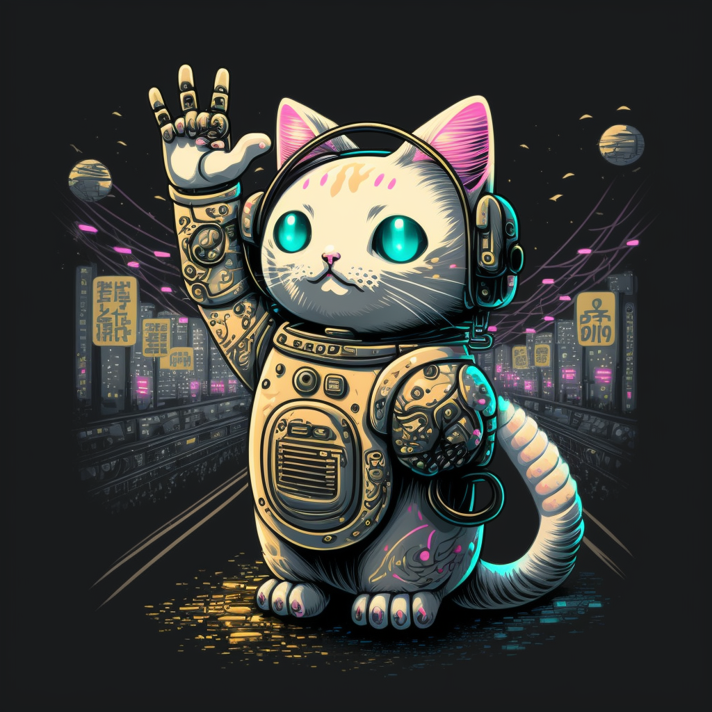

# Lucky Cat GPT

<div align='center'>


[](https://app.netlify.com/sites/lucky-cat-gpt/deploys)

</div>

SvelteKit 1.0 app built on top of the OpenAI API! This project is using the latest `davinci-003` [OpenAI model](https://beta.openai.com/docs/models/gpt-3) to power prompts specific for a fun use-case: Chinese New Year! The image above of the cyberpunk-inspired Lucky Cat (or <i>Maneki Neko</i>) is also generated by AI :)

Deployed [here](https://lucky-cat-gpt.netlify.app/) at Netlify.

## Setting up for development

1. Clone this repository
2. `npm install` to get all dependencies
3. Create a `.env` file at the root of the repository containing these two values:

```
OPENAI_KEY=<OpenAI API key>
OPENAI_MODEL_TEMPERATURE=<Float value from 0.0 to 1.0>
```

These two values are loaded into the SvelteKit app through `$env/static/private` for secure utilisation of the secrets on the server without sharing it to the client.

4. Run dev server with `npm run dev`
5. Navigate to `localhost:5173` to view

Fork or contribute if you will, I welcome it all 😊
